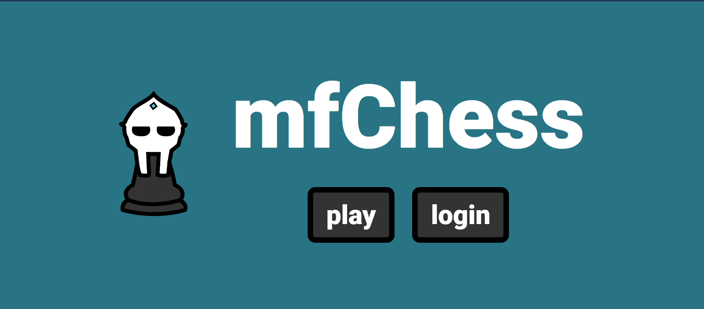
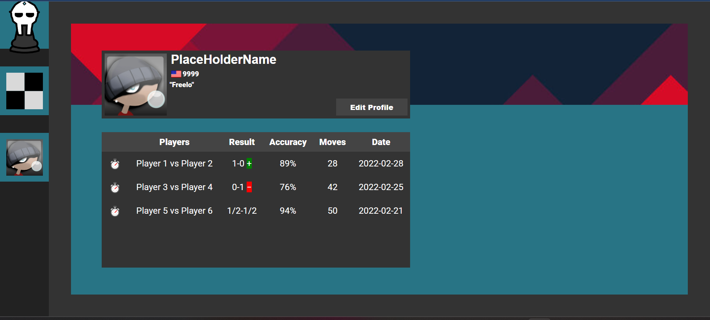

# mfChess Web Backend
[]()
[]()
[]()
[]()
[]()

## ♟️ What is the mfChess?

<p align="center">
  
  
</p>
<p align="center">
  
</p>

Introducing the mfChess backend repository, a crucial component responsible for handling server-client interactions and powering the seamless experience of the mfChess platform. Designed with efficiency and scalability in mind, the backend seamlessly integrates with the frontend to provide an exceptional online chess experience.

At its core, the backend utilizes a MongoDB database server to securely store user information. This ensures that player profiles, game history, and customizable preferences are reliably persisted.

To facilitate real-time gameplay, the backend employs web-socketing technology, enabling two users to connect with each other on the same chess board hosted on the mfChess website. Through this robust connection, players can seamlessly communicate their moves, enabling synchronized gameplay experiences.

For enhanced analysis capabilities, the backend stores each player's moves, allowing for in-depth analysis powered by Stockfish. This integration empowers players to review their strategic decisions and gain valuable insights into their gameplay.

To ensure a seamless experience across sessions, local storage is utilized to save the state of each player's chess pieces. This feature guarantees that players can easily resume their games even after resigning or reloading the page.

mfChess is currently live at <a href="mfchess.com">mfchess.com</a>, offering a seamless and captivating online chess experience. Developers can explore the frontend codebase, contribute to its growth, and collaborate with the frontend repository found at <a href="https://github.com/RiRah123/mfChess-Web-Client">`mfChess-Web-Client`</a> repo, where the frontend client handles the immersive user interface, gameplay interactions, and seamless integration with the backend. Together, these repositories power the live mfChess platform, offering chess enthusiasts a captivating online chess experience like no other.

## 🏃‍♂️ Running mfChess Backend Locally

Using the terminal:

1. Clone the GitHub Project
   ```
   $ git clone https://github.com/RiRah123/mfChess-Server.git
   ```
2. Navigate to the cloned project
   ```
   $ cd mfChess-Server
   ```
3. Install necessary packages using yarn
   ```
   $ yarn install
   ```
   `Note:` If you do not already have yarn install, please check out the <a href="https://classic.yarnpkg.com/lang/en/docs/install/#windows-stable">yarn documentation website</a> for details on how to.
 4. Run using yarn
    ```
    $ yarn run
    ```
    `Note:` You should run the frontend locally at the sametime to ensure the application runs with error. Please check out the frontend repo, <a href="https://github.com/RiRah123/mfChess-Web-Client">`mfChess-Web-Client`</a>, for more details.

## ➕ What is Next for mfChess Backend?

Furthermore, the backend aims to extend its web-socketing capabilities to accommodate more than two users connecting to the same chess game. This expansion opens the door to exciting multiplayer features, including the potential for multi-user chess games and tournaments. Imagine the thrill of competing against multiple opponents simultaneously, fostering a dynamic and engaging chess community within the mfChess platform.

In line with these developments, the backend could also facilitate the organization of tournaments, with grand prizes for the winners. This feature would create a competitive environment that motivates players to showcase their skills and fosters a sense of camaraderie and healthy competition among the community. Additionally, the backend could incorporate advanced tournament management functionalities, including pairing algorithms, time controls, and leaderboard tracking.

As the mfChess backend repository continues to evolve, these future steps hold the promise of enriching the user experience, promoting inclusivity, and fostering a vibrant and engaging chess community. With a focus on seamless integration, enhanced web-socketing capabilities, and innovative features, the backend aims to solidify mfChess as the go-to platform for chess enthusiasts seeking a dynamic and immersive online chess experience.


