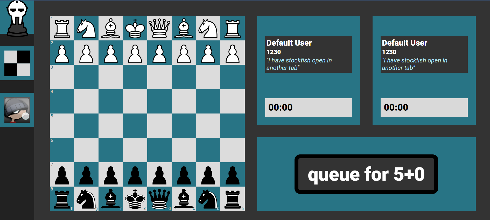

# mfChess Web Backend
[]()
[]()
[]()
[]()
[]()

## ♟️ What is the mfChess?

<p align="center">
  
  
</p>
<p align="center">
  
</p>

## 🏃‍♂️ Running mfChess Backend Locally

Using the terminal:

1. Clone the GitHub Project
   ```
   $ git clone https://github.com/RiRah123/mfChess-Server.git
   ```
2. Navigate to the cloned project
   ```
   $ cd mfChess-Server
   ```
3. Install necessary packages using yarn
   ```
   $ yarn install
   ```
   `Note:` If you do not already have yarn install, please check out the <a href="https://classic.yarnpkg.com/lang/en/docs/install/#windows-stable">yarn documentation website</a> for details on how to.
 4. Run using yarn
    ```
    $ yarn run
    ```
    `Note:` You should run the frontend locally at the sametime to ensure the application runs with error. Please check out the frontend repo, <a href="https://github.com/RiRah123/mfChess-Web-Client">`mfChess-Web-Client`</a>, for more details.

## Scripts

1. `yarn dev`
    - Runs the app in the development mode.
    - Open [http://localhost:3000/graphql](http://localhost:3000/graphql) to view it in the browser.
2. `yarn test`
    - Launches the test runner in the interactive watch mode.\
3. `yarn build`
    - Builds the app for production to the `bin` folder.\
4. `yarn start`
    - Runs app for production.
